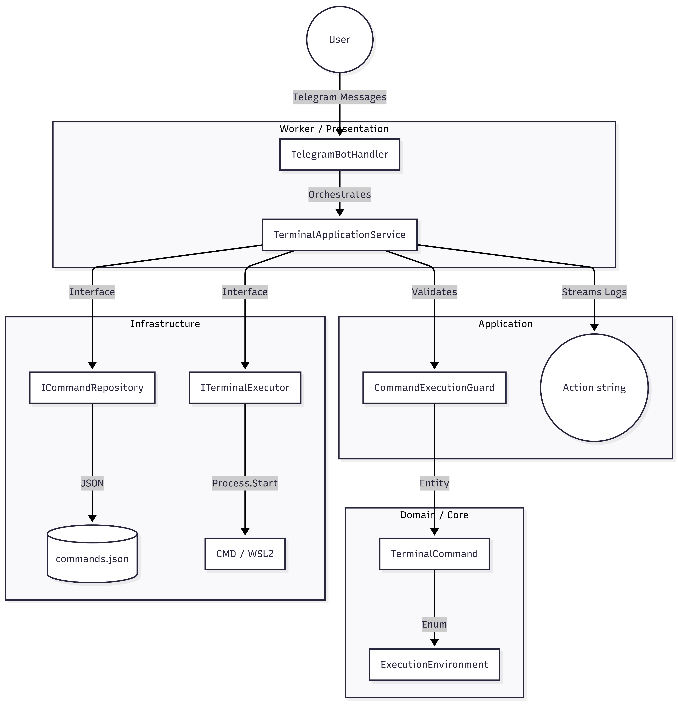

# 📱 TerminalPhone


**TerminalPhone** is a high-performance remote execution bridge that connects your Telegram account directly to your Windows host and Arch Linux (WSL2) environment. Built with **.NET 10.0** and following **Clean Architecture** and **Domain-Driven Design (DDD)** principles, it provides a secure and extensible way to manage your workstation from anywhere.

---

## 🚀 Key Features

*   **Cross-Platform Execution**: Run native commands seamlessly on Windows (CMD/PowerShell) and Arch Linux via `wsl.exe`.
*   **Live Log Streaming**: Real-time terminal output updates directly in your Telegram chat using interactive HTML formatting.
*   **Native Slash Commands**: Automatically integrates your predefined commands into the Telegram bot menu for quick access.
*   **Windows Service Integration**: Operates as a background system service (`BridgeTerminal`) using `Microsoft.Extensions.Hosting.WindowsServices`.
*   **Security First**:
    *   **AdminId Validation**: Only authorized users can trigger executions.
    *   **User Secrets**: Sensitive tokens and IDs are stored using encrypted .NET User Secrets, never in plain text.

---

## 🏗️ Architecture Deep Dive

The project follows a strict separation of concerns to ensure maintainability and testability:



*   **Core**: Contains domain entities (`TerminalCommand`), the `ExecutionEnvironment` (Windows/ArchLinux), and abstraction interfaces.
*   **Application**: Handles business logic via `TerminalApplicationService`, managing the lifecycle of command execution and live log reporting.
*   **Infrastructure**: Implements the technical details, such as `TerminalExecutor` (process management) and `JsonCommandRepository` (data persistence).
*   **Worker**: The entry point. Manages the Telegram Bot lifecycle, Dependency Injection (DI), and Windows Service hosting.

---

## 🛠️ Installation & Setup

### 1. Requirements
*   .NET 10.0 SDK
*   Windows 10/11 with WSL2 (Arch Linux installed as `-d Arch`)
*   Telegram Bot Token (via @BotFather)

### 2. Configuration (`commands.json`)
Define your available commands in the `TerminalPhone.Worker/commands.json` file:
```json
[
  {
    "Trigger": "update_all",
    "Description": "Updates Arch Linux and Windows packages",
    "Script": "sudo pacman -Syu --noconfirm",
    "Environment": 1 
  }
]
```
*Note: Environment `0` = Windows, `1` = ArchLinux.*

### 3. Secrets Management
Configure your credentials securely using the .NET CLI:
```bash
dotnet user-secrets set "TelegramSettings:Token" "YOUR_BOT_TOKEN"
dotnet user-secrets set "TelegramSettings:AdminId" "YOUR_USER_ID"
dotnet user-secrets set "TelegramSettings:GroupId" "YOUR_GROUP_ID"
```

### 4. Automated Installation
Use the provided `setup_bridge_terminal.bat` script (requires Admin rights). It will:
1. Elevate itself via UAC.
2. Prompt for your Telegram credentials.
3. Configure User Secrets.
4. Publish the project and install it as the `BridgeTerminal` Windows Service.

---

## ⌨️ Usage Examples

Once the service is running, simply open your Telegram bot:

*   `/start`: Initializes the bot and syncs the slash command menu.
*   `/update_all`: Triggers a full system update on the Arch Linux WSL instance.
*   `/check_arch`: Executes `uname -a` and returns the kernel info.
*   `/shutdown`: Safely shuts down the Windows host remotely.
